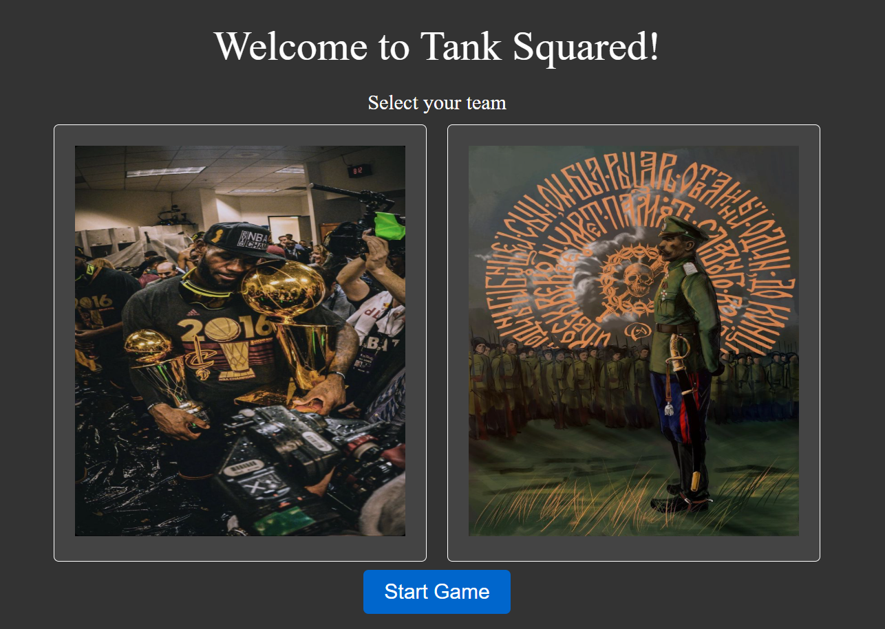

# TANK SQUARED

<p align="center">
  
</p>

<div align="center">

*Bron's army vs the Russians! Who will win?*
*A turn-based tank battle game built with modern web technologies.*

</div>

---

## 🎮 Overview

**Tank Squared** is a turn-based tank strategy game in development in parallel with [`HTTP_C`](https://github.com/ChristianHrs/http_c/tree/main), a web server and messaging system built in C.

In Tank Squared, players command tanks, adjust movement, and fire projectiles using realistic physics simulations. Each turn challenges you to outmaneuver and outshoot your opponent, whether it's the AI enemy or other players in future versions.

This project combines **PixiJS** for graphics rendering and **Planck.js** for physics simulation, providing a foundation for destructible environments, tank customization, and immersive gameplay.

---

## 🚀 Current Features (v1.0)

* ✔️ Projectile motion mechanics
* ✔️ Collision detection (ground and player)
* ✔️ Turn-based gameplay loop
* ✔️ Basic enemy tank behavior
* ✔️ Movement detection via Planck.js
* ✔️ Functional start screen

---

## 🔧 Upcoming Features (v1.0.1 Roadmap)

* ✔️ Terrain destruction
* ✔️ Procedural terrain generation
* ✔️ Enhanced physics (motor speed, friction, etc.)
* ⬜ Expanded tank properties
* ✔️ Health bars and death states
* ✔️ Damage detection
* ⬜ Multiple screens (pause, settings, etc.)
* ⬜ Refined player edges in Planck.js
* ⬜ Revamped shooting controls
* ⬜ Object cleanup and redundant deletion
* ⬜ Optimized game loop

---

## 📖 Documentation References

* [PixiJS Documentation](https://pixijs.download/dev/docs/index.html)
* [Planck.js Documentation](https://piqnt.com/planck.js/docs)

---

## 🛠️ Getting Started

### 1. Install Node.js

Download and install the latest version of [Node.js](https://nodejs.org/en).

Verify installation:

```bash
node -v
# v22.14.0

npm -v
# 10.9.0
```

### 2. Clone the Repository

```bash
git clone https://github.com/Chris33871/tank_squared.git
```

### 3. Install Dependencies

```bash
npm install
```

Check dependencies:

```bash
npm list pixi.js planck
# your-project@1.0.0 /path/to/project
# ├── pixi.js@8.9.1  
# └── planck@1.1.0
```

### 4. Run the Game

```bash
npx vite
```

Expected output:

```
VITE v6.2.3  ready in 214 ms

➜  Local:   http://localhost:5173/
➜  Network: use --host to expose
➜  press h + enter to show help
```

Open the local link to start playing.

<p align="center">
  
</p>

---

## 🧩 Tech Stack

* **PixiJS** → 2D rendering engine for smooth visuals
* **Planck.js** → Physics simulation for realistic gameplay
* **Vite** → Fast build tool and dev server
* **JavaScript/TypeScript** → Core game logic

---

---

## 📜 License

This project is licensed under the MIT License. See [LICENSE](./LICENSE) for details.

---

## 🗺️ Road Ahead

Tank Squared is still in early stages. The near-term goal is refining core mechanics and introducing destructible terrain. Long-term plans include multiplayer support, multiple tank classes, and advanced AI. Stay tuned for updates.
