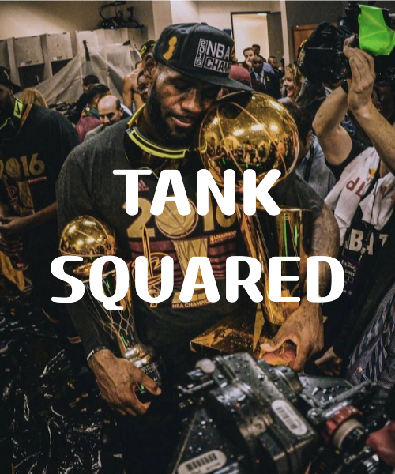

# TANK SQUARED

  

*Bron's army vs the Russians! Who will win?*  
(This is a turn-based tank game that is currently in development)

### File Structure

my-pixi-game/\
│\
├── assets/               # All game assets (images, sounds, etc.)\
│   ├── images/           # Sprites, backgrounds, UI elements\
│   ├── sounds/           # Sound effects, music\
│   └── fonts/            # Custom fonts, if any\
│\
├── src/                  # All source code\
│   ├── core/             # Core game logic\
│   │   ├── Game.js       # Main game setup and loop\
│   │   ├── Loader.js     # Asset loading logic\
│   │   ├── SceneManager.js # Manages different scenes (e.g., menus, game levels)\
│   │   └── Utils.js      # Utility functions\
│   │
│   ├── scenes/           # Individual game scenes (menu, game, game over)\
│   │   ├── MainMenu.js   # Main menu scene\
│   │   ├── GameScene.js  # Main game scene\
│   │   └── GameOver.js   # Game over scene\
│   │\
│   ├── objects/          # Game objects (player, enemies, items, etc.)\
│   │   ├── Player.js     # Player character class\
│   │   ├── Enemy.js      # Enemy character class\
│   │   └── Item.js       # Collectible item class\
│   │\
│   ├── ui/               # UI elements (scoreboard, health bar, etc.)\
│   │   ├── Button.js     # Reusable button class\
│   │   └── Scoreboard.js # Scoreboard display\
│   │\
│   └── main.js           # Entry point of the application (sets up PixiJS)\
│\
├── config/               # Configuration files\
│   └── settings.js       # Game settings (e.g., screen width, height, game speed)\
│\
├── index.html            # Main HTML file to load the game\
├── styles.css            # Optional: CSS for the game's HTML container\
└── package.json          # Project metadata and dependencies\

## Version 1.0: Core Mechanics
- [x] Implementing projectile motion mechanic 
- [x] Collisions between ground, and player
- [x] Main game loop and turn by turn play
- [x] Enemy tank 
- [x] Movement detection in planckjs
- [x] Start Screen 

## Version 1.0.1: Enhancing Mechanics
- [ ] Terrain destruction
- [x] Terrain generation
- [ ] Improved Physics simulation (e.g., increased motor speed, friction, etc)
- [ ] Better tank properties 
- [ ] Health Bars, and Death
- [ ] Damage detection
- [ ] Different types of screens: Pause screen, settings screen, etc
- [ ] Refined player edges in planckjs
- [ ] Revamped shooting controls
- [ ] Redundant object deletion, and clean up
- [ ] Improved game loop

### Current Bugs to be fixed:
- [ ] Projectile firing working weirdly with the new generated terrain...

### Features to be added:
- [ ] Online multiplayer 

### Possible features:
- [ ] Larger and more varied set of maps
- [ ] Different tank options
- [ ] Play against AI
